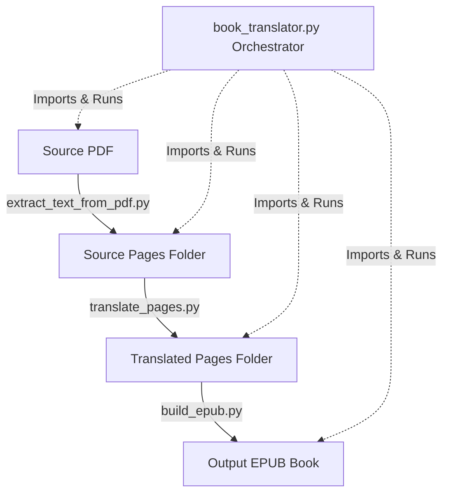

# Book Translation & EPUB Packaging Pipeline Walkthrough

This document outlines the refactored, general-purpose pipeline that extracts, translates, and packages books from a PDF into a structured EPUB with pop-up footnotes and an interactive Table of Contents.

The architecture is fully modular, allowing you to run individual steps manually using helper scripts, or execute the entire process end-to-end with the orchestrator script.

---

## 1. Modular Script Architecture

The project directory has been restructured to separate the concerns of each pipeline phase into clean, CLI-capable Python modules:



### 1.1. Text Extraction
- **File**: [extract_text_from_pdf.py](file:///c:/Users/ErlendHeggelund/Downloads/Books/Devout_Life/extract_text_from_pdf.py)
- **Purpose**: Opens the source PDF using PyMuPDF and extracts text page-by-page into separate `.txt` files under a source directory.
- **Standalone CLI Usage**:
  ```bash
  python extract_text_from_pdf.py /path/to/book.pdf -o folder_name
  ```

### 1.2. Page Translation
- **File**: [translate_pages.py](file:///c:/Users/ErlendHeggelund/Downloads/Books/Devout_Life/translate_pages.py)
- **Purpose**: Automatically translates extracted page files using `deep-translator`. Handles long files by splitting paragraphs exceeding 4,000 characters and implements exponential backoff to handle rate limits.
- **Standalone CLI Usage**:
  ```bash
  python translate_pages.py --src-dir folder_name --dest-dir translated_folder --target-lang no
  ```

### 1.3. EPUB Compilation
- **File**: [build_epub.py](file:///c:/Users/ErlendHeggelund/Downloads/Books/Devout_Life/build_epub.py)
- **Purpose**: Parses translated text pages, cleans footers/page numbers dynamically based on title/author metadata, parses interactive XHTML Tables of Contents and Indexes, extracts footnotes sequentially, and compiles everything into a standards-compliant EPUB book using `EbookLib`.
- **Standalone CLI Usage**:
  ```bash
  python build_epub.py --src-dir translated_folder --output book.epub --title "My Book" --author "Author Name" --toc-start 2 --toc-end 6
  ```

---

## 2. Reusable Orchestrator

The main coordinator script is [book_translator.py](file:///c:/Users/ErlendHeggelund/Downloads/Books/Devout_Life/book_translator.py). It has been refactored to remove all code duplication, acting as a clean wrapper that imports the three modular scripts.

### 2.1. Key Orchestrator Features
- **Dynamic Module Import**: Automatically adds its own directory to `sys.path` to import local helper scripts, meaning you can run it from any working directory.
- **Dependency Checks**: Inspects the environment and raises friendly, user-facing error messages if required modules (`pymupdf`, `deep-translator`, `EbookLib`) or helper files are missing.
- **TOC & Index Handling**: Dynamically parses TOC bounds and Index pages.
- **Preflight Fixes**:
  - Automatically appends numerical counters to multiple preface/index pages (e.g., `preface2.xhtml`) to prevent duplicate entry names inside the EPUB zip package.
  - Dynamically builds custom running footer/header filters using regex derived from the input `--title` and `--author` CLI values.

### 2.2. End-to-End CLI Command Example
To run the entire pipeline end-to-end starting with a PDF:
```bash
python book_translator.py --pdf devoutlife.pdf --src-dir pages --trans-dir pages_norwegian --output Devout_Life_Norwegian.epub --title "Introduksjon til det fromme livet" --author "St. Frans av Salg" --toc-start 2 --toc-end 6
```

### 2.3. Flow Control Flags
The orchestrator supports several flags to run partial stages of the pipeline:
- `--skip-pdf`: Skips extraction and begins directly with translation.
- `--skip-translation`: Skips translation and begins directly with EPUB compilation (extremely useful if you want to manually edit/review translated pages before compiling).
- `--skip-epub`: Skips EPUB compilation.

---

## 3. Environment & Validation Status
- **Verification Result**: Ran the refactored orchestrator script on the `pages_norwegian` directory with `--skip-translation` to package the EPUB book without warnings or errors.
- **Cleanup**: Removed the temporary footnote analysis files (`scratch_summary.txt`) to keep your project folder clean.
- **Retention**: Retained all three modular helper scripts alongside the orchestrator in the project directory.
