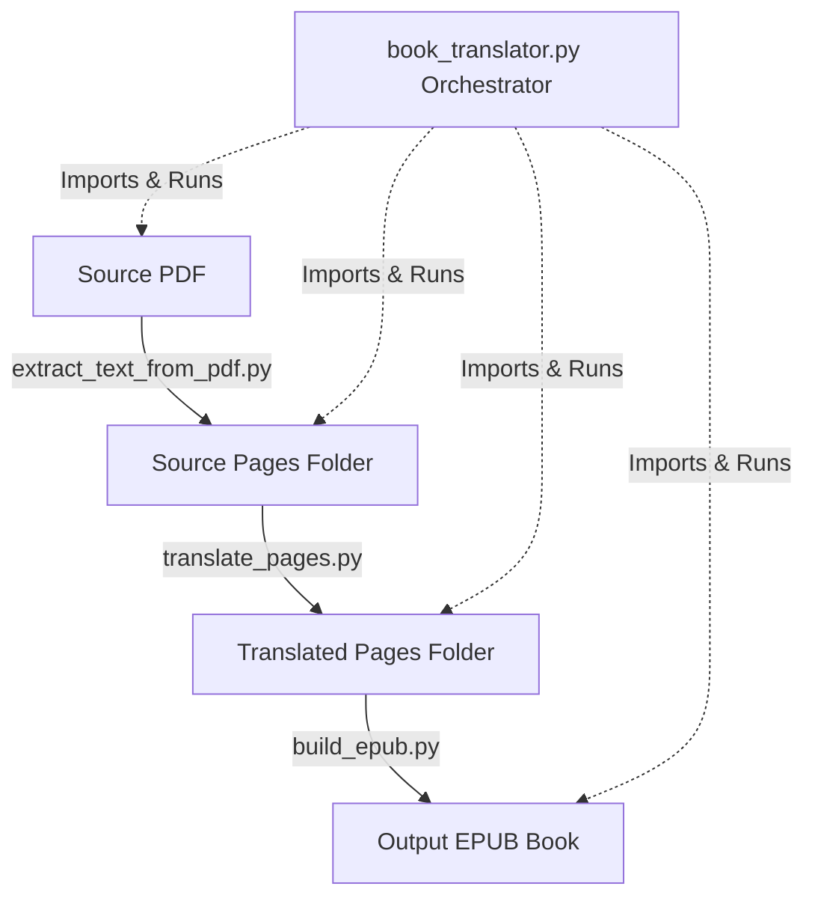

# Book Translation & EPUB Compiler Pipeline

This pipeline automates extracting text from a PDF, translating page files, and compiling them into a professionally structured EPUB with interactive table of contents, running footers cleaning, and pop-up footnotes support (EPUB 3).

The architecture is fully modular, allowing you to run individual steps manually using helper scripts, or execute the entire process end-to-end with the orchestrator script.

---

## 📋 Prerequisites

Before running the scripts, make sure you have the required Python libraries installed:

```bash
pip install pymupdf deep-translator EbookLib
```

---

## 📂 File Structure

- **`book_translator.py`**: The main orchestrator script that ties all steps together.
- **`extract_text_from_pdf.py`**: Helper script to extract PDF text page-by-page.
- **`translate_pages.py`**: Helper script to translate pages using `deep-translator` with paragraph chunking and rate-limit backoff.
- **`build_epub.py`**: Helper script to compile text pages into a structured EPUB.
- **`README.md`**: Consolidated project overview, technical walkthrough, and usage guide (this file).

---

## ⚙️ Modular Pipeline Architecture

The pipeline consists of three core phases that can be run together via the orchestrator or run individually:



### 1. Text Extraction (`extract_text_from_pdf.py`)
- **Action**: Opens the source PDF using PyMuPDF and extracts text page-by-page.
- **Output**: Generates one `.txt` file per page (e.g. `page_1.txt`, `page_2.txt`) in a specified directory.
- **Robustness**: Safely catches missing dependency errors and guides you on installation.

### 2. Page Translation (`translate_pages.py`)
- **Action**: Automates the translation of extracted page files using `deep-translator`.
- **Length Chunking**: Google Translate limits requests to 5000 characters. The script safely splits pages exceeding 4000 characters by paragraph (falling back to line splits if paragraphs are exceptionally long).
- **API Resilience**: Implements exponential backoff retry logic (up to 5 attempts) to handle API rate limiting and network hiccups gracefully.

### 3. EPUB Compilation (`build_epub.py`)
This script parses the translated pages, formats the book structure, and packages it using `EbookLib`.

- **Footer & Running Header Cleaning**: Dynamically filters out common book running footers/headers (e.g. page numbers, author, or book titles) to prevent them from interrupting body text. Custom filters are compiled at runtime using the `--title` and `--author` CLI values.
- **Chapter Detection & Bound Splits**: Auto-detects chapter markers (e.g., matching `DEL ` / `PART ` or `KAPITTEL ` / `CHAPTER ` or custom terms) and segments document files accordingly. Text page numbers appearing inline are stripped.
- **Sequential Footnote Resolution**: Extracts footnotes sequentially from the bottom of each page. anchor tags (`<sup><a epub:type="noteref">`) are dynamically linked to their footnotes, which are built as modern EPUB 3 `<aside epub:type="footnote">` popup boxes. A strictly increasing range check prevents text page numbers from being misidentified as footnote definitions.
- **Duplicate Prevention**: If multiple preface or index pages are detected (e.g. "Forord" matched multiple times), unique filename and ID counters are automatically appended (e.g., `preface2.xhtml`) to prevent duplicate entry names inside the EPUB zip container.

---

## 🚀 Orchestrator Usage

You can run the entire pipeline end-to-end starting with a PDF file by invoking `book_translator.py`:

```bash
python book_translator.py --pdf mybook.pdf --src-dir pages --trans-dir pages_norwegian --output My_Book.epub --title "My Book" --author "Myself" --toc-start 2 --toc-end 6
```

### Flow Control Flags:
- `--skip-pdf`: Skips text extraction from PDF (uses existing `.txt` files in `--src-dir`).
- `--skip-translation`: Skips translating text pages (uses existing files in `--trans-dir`). This is extremely useful if you want to manually edit or review translated pages before building the final EPUB.
- `--skip-epub`: Skips EPUB packaging.

---

## 🛠️ Standalone Helper Script Usage

Each step can also be run independently for modular control:

### Step 1: PDF Extraction
```bash
python extract_text_from_pdf.py devoutlife.pdf -o pages
```

### Step 2: Translation
```bash
python translate_pages.py --src-dir pages --dest-dir pages_norwegian --target-lang no
```

### Step 3: EPUB Packaging
```bash
python build_epub.py --src-dir pages_norwegian --output book.epub --title "My Book Title" --author "Author Name" --toc-start 2 --toc-end 6
```

*Note: You can pass `--no-footnotes`, `--no-toc`, or `--no-index` flags to `build_epub.py` (or the orchestrator) if your target book does not contain these elements.*
